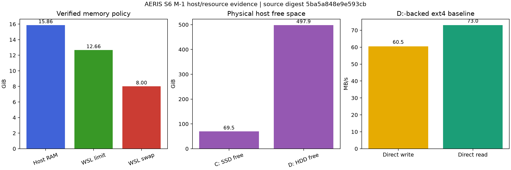

# AERIS S6 M-1 host/resource report

Status: **CONDITIONAL_GO_M0_M1_ONLY**

The WSL policy and supported distro relocation passed. The repository remains
Linux-native and hash/identity-preserved. The D:-backed ext4 filesystem measures
60.5 MB/s direct write and
73.0 MB/s direct read: honest HDD-class
performance. M0/M1 code and tests are authorized; heavy mesh/CFD work remains
blocked until real case footprints complete the campaign storage forecast.

## Verified resources

| Quantity | Value |
|---|---:|
| Host physical RAM | 15.86 GiB |
| Effective WSL RAM | 12.66 GiB |
| WSL swap | 8.00 GiB |
| Logical processors | 12 |
| C: SSD free | 69.45 GiB |
| D: HDD free | 497.90 GiB |

## Gate matrix

| Gate | Result |
|---|---|
| wsl2_confirmed | PASS |
| physical_ram_inventoried | PASS |
| wsl_memory_policy_applied_and_verified | PASS |
| cpu_and_swap_verified | PASS |
| repository_linux_native | PASS |
| recovery_vhd_exported_and_hash_verified | PASS |
| registered_distro_relocated_with_supported_wsl_move | PASS |
| repository_identity_and_user_changes_preserved | PASS |
| linux_native_storage_benchmark_recorded | PASS |
| campaign_storage_forecast_complete | OPEN |
| first_mesh_and_canary_footprints_measured | OPEN |

## Storage interpretation

The absolute remaining-campaign upper bound is 367.62 GiB only when active-case footprint is zero. It is not a campaign forecast. The actual bound follows `free >= 1.30 * forecast_remaining + 3 * active_case_footprint + 20 GiB` and decreases once the first written mesh and complete canary establish their footprints.

## Source hashes

| Input | SHA-256 |
|---|---|
| `host_inventory_windows.json` | `61d04172b0a6be7a763111b5a389ec6c54bf751edbc00763bacb65288eee0b43` |
| `host_inventory_linux.json` | `543cb3688397a34b8517482602efcaf9a27a136a4c7f13d68deec59e4d474aa7` |
| `post_restart_verification.json` | `1fec2ec3373e270933a5196aa9478c1783d612aca905ed99fbb667f6371d1aa1` |
| `post_move_verification.json` | `c257863322575a832db3cb4b1a60bb59f0aada45d3d91aa45c24bbbae4ec9dce` |
| `storage_benchmark_001/benchmark.json` | `14c9d3cb98c0e532dab40658736bdbea0e1e5cd4248fec28c92690f083e09e7a` |
| `m1_gate.json` | `3db61eb3b478e85c37f4840426171615bab39ba12150b67df2dc46004f805245` |
